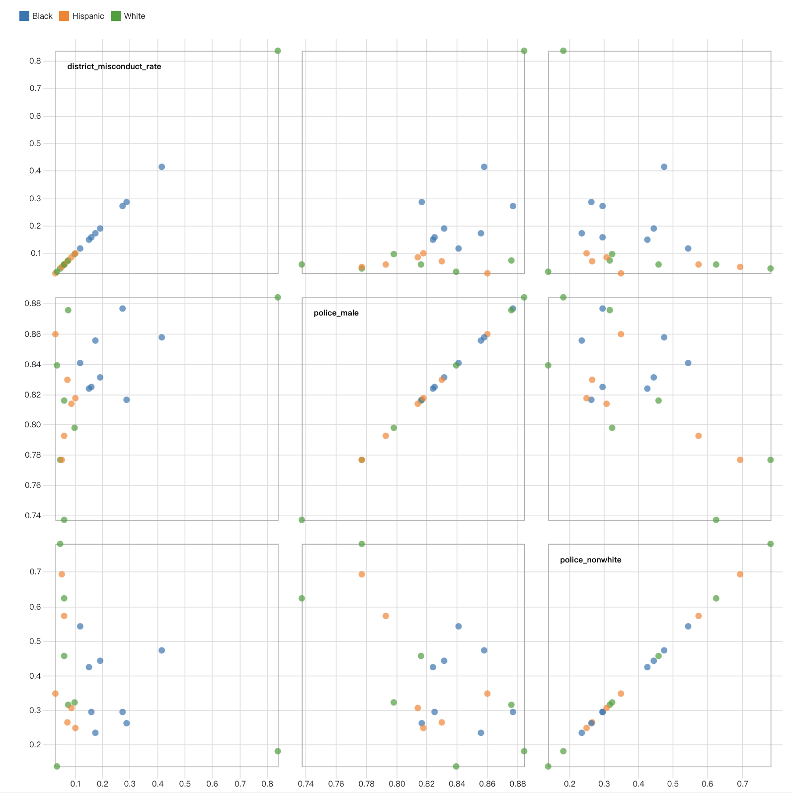
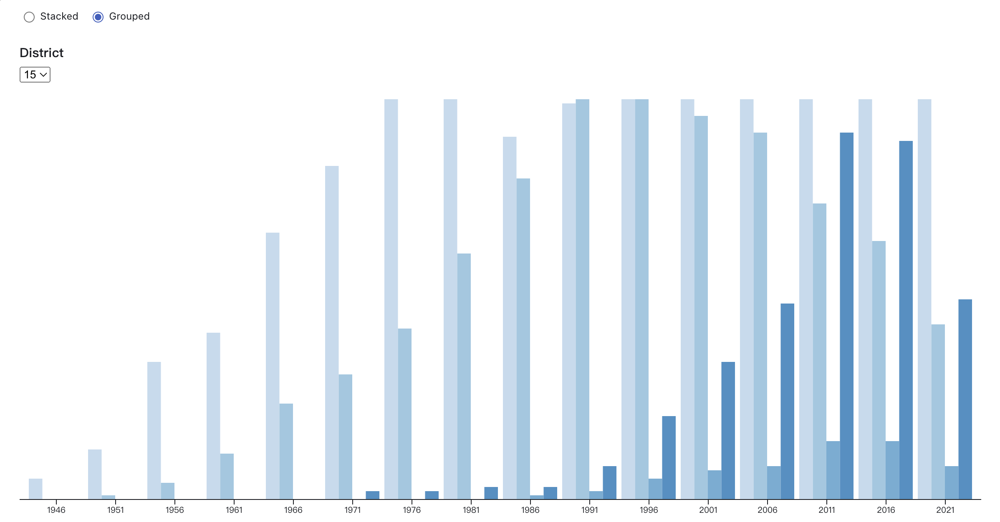

# Checkpoint 3: Interactive Visualization with D3.js
## Important Info
In checkpoint 3, we use SQL to select the data from CPDB, use Python to do the data cleaning and processing, then finally we use the D3.js and Observable to implement the interactive visualization.

Same as the checkpoint 1, If you want to select the data first, you need to set up and connect CPDB database remotely before executing the code.

## Interactive Visualizations
Each of the visualizations was produced on https://observablehq.com/ with using D3.js. To view the visualizations and interact with the graph for each question, you can simply navigate to the link provided in the following sections.

### Visualization 1: Brushable Scatterplot matrix
*Note: This question was originally "A scatter plot matrix shows the relationship between officer race/gender percentage in the whole police system vs. the group of police officers who conduct misconduct" in our project proposal, but it was changed due to the checkpoint 1 iteration.*

To view interactive visualization 1, click the link: https://observablehq.com/@honghong1012/checkpoint-3-interactive-visualization-with-d3-js-1

### Visualization 2: Stacked to group chart
To view interactive visualization 2, click the link: https://observablehq.com/@honghong1012/checkpoint-3-interactive-visualization-with-d3-js-2

In this visualization, user can select the district number to generate animating chart. The graph is set in certain interval to transform between grouped and stacked by default. After user click on certain format, the animation would stop.

### Instructions on performing this section
We provide the sql script for selecting data and python script for data cleaning separately, these files are all attached in the src/ . If you want to reproduce the result, you need to first run the sql script to extract data for certain districts. Then take the data as input and run the corresponding python script. The processed data would be in .csv and could be uploaded to the Observable and perform data visualizations. Welcome to play and explore the data!
