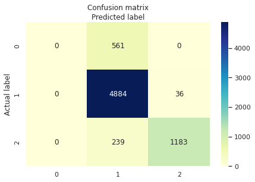

# Checkpoint 4: Machine Learning
## Important Info
In checkpoint 4, we also use SQL to select the data from CPDB, use Python to do the data cleaning and processing, then finally we use the scikit-learn and Google colab to implement the interactive visualization.

Same as the checkpoint 1, If you want to select the data first, you need to set up and connect CPDB database remotely before executing the code.

## Prerequisites
Here we only provide the colab link for reproduce, if you want to implement in the local environment, the prerequisites you need includes but is not limited to the following:
* Jupyter Notebook or Lab (Required)
* NumPy 1.21.6
* Scikit-Learn 1.0.0
* Python 3.7

## Focus Questions
Each of the question was produce on Google colab with scikit-learn. To view the code and re-produce the process, you can simply navigate the link provided in the following sections.

### Question 1: 
*Note: The question were originally different in our project proposal, but they were changed and adjusted due to the iteration.*

To view machine learning code of question 1, click the link: https://colab.research.google.com/drive/1Qw4np_9mji468ysDq7Q7phXMDDtL-L66?usp=sharing 

### Question 2: 
To view interactive visualization 2, click the link: 
https://colab.research.google.com/drive/19vbP4gJBUZSh7VpjllxTgygoXs-xEMRU?usp=sharing

### Instructions on performing this section
For question 1, we provide the question1.sql in src folder for users to query the needed data. After saving the csv as test.csv like the one under src/csv folder, user could use question1_helper to produce data cleaning and pre-process. Then the output data from helper function could be uploaded to the corresponding colab. 

For question 2, we use openfire to finish the data cleaning so we cannot provide the script here. But all the completed and need csv files are attached into the src/csv folder. User can upload the corresponding the data to colab.
 
Welcome to play and explore the data and don't forget to change the according file name or path to your input!
